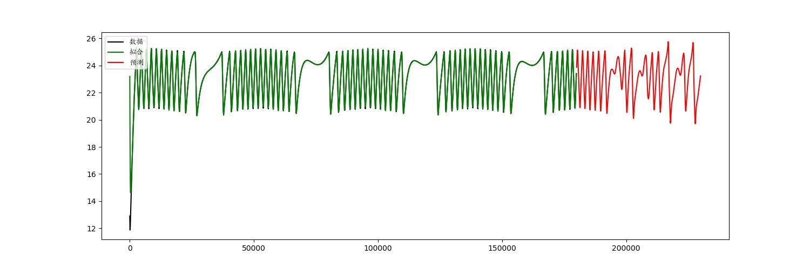
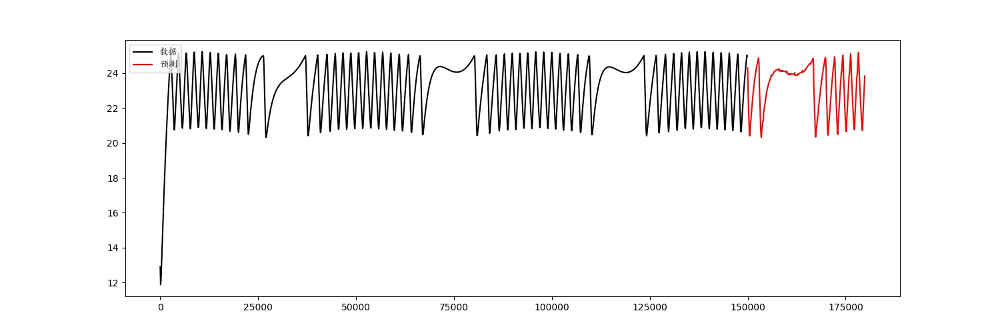

# Heat-Load-LSTM

## Files

- /data: data in csv and mat format

- data_pre.py: utils function to read and format the data

- visualization.py: utils function to save and show the fitted data or prediction result

- lstm_base_on_TFTS.py: a single layer LSTM model base on TensorFlow Time Series(TFTS)   (Unsuccessful Experiment)

- lstm_base_on_cell.py: a Multi-layer LSTM model base on BasicLSTMCell API

## Univariate prediction with LSTM

### Using the model base on TFTS

### Using the model base on BasicLSTMCell API

- Predict temperature by the previous temperature

- Use 83% of the data to train, the rest to test

